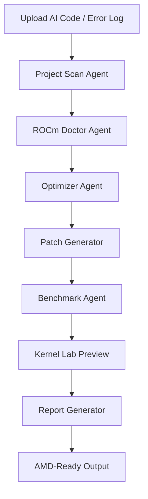
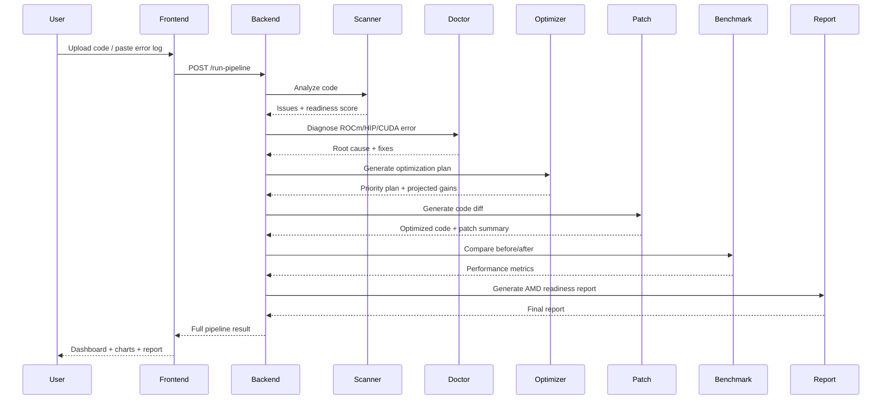
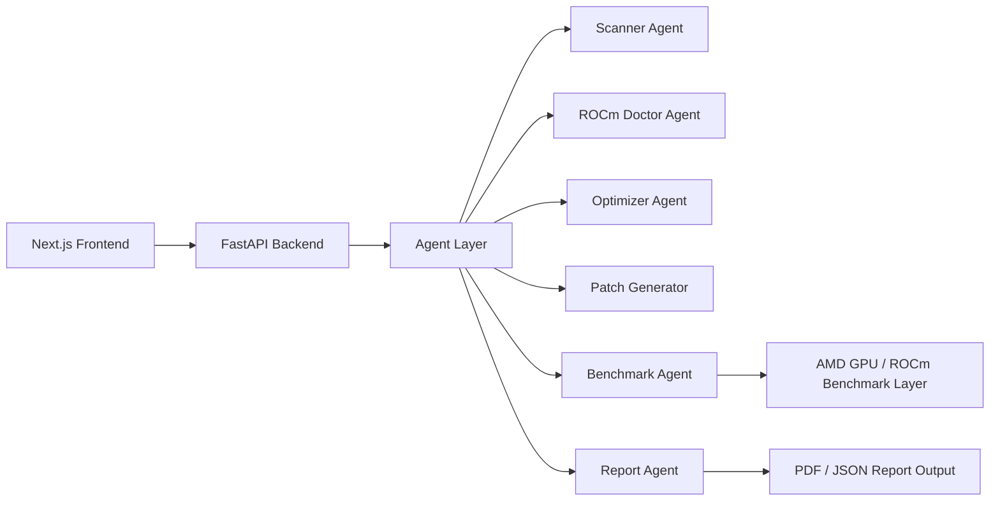
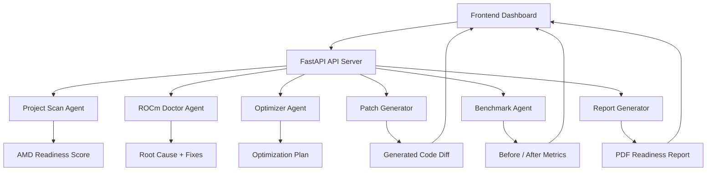

# YOUSUN Axion

## Autonomous GPU Intelligence for AI Workloads

**YOUSUN Axion** is an AI-powered engineering platform that helps developers turn slow, broken, or non-optimized AI workloads into **AMD-ready, optimized, benchmarked deployments**.

It scans AI code, diagnoses ROCm/HIP/CUDA-related issues, generates optimization plans, creates code patches, benchmarks before/after performance, and exports a professional **AMD Readiness Report**.

---

## Tagline

> **Scan. Diagnose. Optimize. Patch. Benchmark. Report.**

---

## Problem

Developers who want to run AI workloads on AMD GPUs often face major challenges:

- CUDA-specific code and dependencies
- ROCm/HIP runtime errors
- GPU memory issues
- Slow inference performance
- No clear benchmark evidence
- Manual debugging and optimization complexity
- Difficulty preparing AI workloads for AMD Developer Cloud

Most AI tools only generate text suggestions. **YOUSUN Axion** goes further by building a full engineering workflow around AMD GPU readiness.

---

## Solution

YOUSUN Axion acts like an **autonomous GPU engineer**.

A developer uploads or pastes AI code and an error log. Axion then:

1. Scans the project
2. Detects ROCm/CUDA/GPU compatibility issues
3. Diagnoses root causes
4. Generates optimization recommendations
5. Creates actual code patches
6. Benchmarks before/after performance
7. Generates a professional AMD Readiness Report

---

## Core Workflow



---

## End-to-End Pipeline



---

## Key Features

### 1. Project Scan

The Project Scan module analyzes AI code and detects:

- Framework type
- Workload type
- Precision mode
- CUDA-specific usage
- Batch size risks
- ROCm compatibility problems
- AMD readiness score

Example output:

```txt
Framework: PyTorch
Workload: LLM Inference
Precision: FP32
Target GPU: AMD MI300X
Environment: ROCm
Readiness Score: 42/100
```

---

### 2. ROCm Doctor

ROCm Doctor is an AI diagnostic module for GPU errors.

It detects issues such as:

- HIP out-of-memory
- CUDA-specific dependency
- ROCm runtime mismatch
- AMD GPU not detected
- FP32 memory pressure
- Unsupported package usage

Example:

```txt
Input:
RuntimeError: HIP out of memory while running model.generate on cuda device.

Output:
Root Cause:
Large FP32 tensors and high batch size may be causing GPU memory pressure.

Recommended Fixes:
- Convert FP32 to BF16
- Reduce batch size
- Enable torch.inference_mode()
- Reduce sequence length
```

---

### 3. Optimizer

The Optimizer module generates a prioritized engineering plan.

It recommends:

- FP32 to BF16 conversion
- Batch size tuning
- Inference mode
- CUDA dependency replacement
- ROCm benchmark profiling
- Attention path optimization

Example:

```txt
1. Convert FP32 operations to BF16 — High Impact
2. Tune batch size for AMD GPU memory stability — High Impact
3. Replace CUDA-specific dependencies — High Impact
4. Enable torch.inference_mode() — Medium Impact
5. Add ROCm benchmark profile — Medium Impact
```

---

### 4. Patch Generator

The Patch Generator creates actual code diffs.

Example:

```diff
- torch_dtype=torch.float32
+ torch_dtype=torch.bfloat16

- batch_size = 8
+ batch_size = 4

- outputs = model.generate(**inputs)
+ with torch.inference_mode():
+     outputs = model.generate(**inputs)
```

This makes Axion more than a suggestion tool. It becomes a practical engineering assistant.

---

### 5. Benchmark Agent

The Benchmark Agent provides measurable before/after proof.

Example benchmark result:

| Metric | Before | After | Improvement |
|---|---:|---:|---:|
| Latency | 5.42s | 2.31s | 57.4% faster |
| Tokens/sec | 28.4 | 71.6 | 152.1% higher |
| GPU Memory | 42.3GB | 24.7GB | 41.6% lower |
| AMD Readiness Score | 42/100 | 96/100 | +54 points |

---

### 6. Kernel Lab Preview

Kernel Lab is an advanced technical preview module that shows kernel-level optimization potential.

```txt
Target Operation: Attention Kernel
Estimated Speedup: 1.82x
Correctness: Passed
```

This gives the project deeper GPU performance engineering value.

---

### 7. Reports

The Reports module generates a professional **AMD Readiness Report**.

Report includes:

- Project overview
- Detected issues
- Root cause analysis
- Optimization plan
- Patch summary
- Benchmark results
- Business impact
- Final verdict
- PDF download option

---

## Application Architecture



---

## System Architecture



---

## Frontend Pages

| Page | Purpose |
|---|---|
| Dashboard | Main pipeline overview |
| Workflow | End-to-end system workflow |
| Project Scan | AI code scanning assistant |
| ROCm Doctor | AI diagnostic chat box |
| Optimizer | AI optimization assistant + chat |
| Patch Generator | Code patch and diff viewer |
| Benchmark | Performance chart and metrics |
| Kernel Lab | Advanced kernel optimization preview |
| Reports | Report preview and PDF download |
| Settings | Platform configuration |

---

## Backend API Endpoints

| Endpoint | Method | Description |
|---|---|---|
| `/` | GET | API home |
| `/health` | GET | Health check |
| `/api-info` | GET | API metadata |
| `/sample-demo` | GET | Loads sample broken AI workload |
| `/scan` | POST | Scans AI code |
| `/doctor` | POST | Diagnoses ROCm/HIP/CUDA errors |
| `/optimize` | POST | Generates optimization plan |
| `/generate-patch` | POST | Generates optimized code patch |
| `/benchmark` | POST | Runs benchmark simulation |
| `/report` | POST | Generates AMD readiness report |
| `/run-pipeline` | POST | Runs full Axion pipeline |

---

## Tech Stack

### Frontend

- Next.js
- React
- Tailwind CSS
- Recharts
- Lucide React
- jsPDF
- localStorage workspace state

### Backend

- Python
- FastAPI
- Pydantic
- Uvicorn
- Rule-based agent pipeline
- Modular agent architecture

### AI / Agent Modules

- Scanner Agent
- ROCm Doctor Agent
- Optimizer Agent
- Patch Generator
- Benchmark Agent
- Report Agent

### Target Platform

- AMD Developer Cloud
- AMD Instinct MI300X
- ROCm
- PyTorch ROCm workflows

---

## Project Structure

```txt
yousun-axion/
│
├── backend/
│   ├── main.py
│   ├── requirements.txt
│   ├── agents/
│   │   ├── rocm_doctor_agent.py
│   │   ├── optimizer_agent.py
│   │   ├── patch_generator.py
│   │   ├── benchmark_agent.py
│   │   └── report_agent.py
│   ├── sample_projects/
│   │   └── inference.py
│   └── reports/
│
├── frontend/
│   ├── app/
│   │   ├── page.tsx
│   │   ├── globals.css
│   │   ├── workflow/
│   │   ├── project-scan/
│   │   ├── rocm-doctor/
│   │   ├── optimizer/
│   │   ├── patch-generator/
│   │   ├── benchmark/
│   │   ├── kernel-lab/
│   │   ├── reports/
│   │   └── settings/
│   ├── components/
│   │   ├── Sidebar.tsx
│   │   └── Topbar.tsx
│   ├── lib/
│   │   ├── api.ts
│   │   └── pipelineStore.ts
│   └── package.json
│
├── docs/
│   ├── architecture.md
│   ├── workflow.md
│   └── demo_script.md
│
└── README.md
```

---

## How to Run Locally

### 1. Clone the repository

```bash
git clone https://github.com/your-username/yousun-axion.git
cd yousun-axion
```

### 2. Run backend

```bash
cd backend
python -m venv venv
```

Windows:

```bash
venv\Scripts\activate
```

macOS / Linux:

```bash
source venv/bin/activate
```

Install dependencies:

```bash
pip install -r requirements.txt
```

Start FastAPI server:

```bash
uvicorn main:app --reload
```

Backend:

```txt
http://127.0.0.1:8000
```

API docs:

```txt
http://127.0.0.1:8000/docs
```

### 3. Run frontend

Open another terminal:

```bash
cd frontend
npm install
npm run dev
```

Frontend:

```txt
http://localhost:3000
```

---

## Demo Workflow

1. Open the dashboard
2. Click **Run Full Axion Pipeline**
3. Axion scans the sample workload
4. It detects CUDA/ROCm issues
5. It diagnoses HIP memory risk
6. It generates optimization recommendations
7. It creates code patches
8. It shows before/after benchmark results
9. It generates an AMD Readiness Report
10. Go to Reports page and download the PDF

---

## Sample Workload

The demo workload intentionally includes common AI deployment problems:

```python
batch_size = 8

model = AutoModelForCausalLM.from_pretrained(
    model_name,
    torch_dtype=torch.float32
)

model = model.to("cuda")
```

Axion detects:

- High batch size
- FP32 precision
- CUDA-specific device usage
- HIP out-of-memory risk

Then it generates optimized changes such as:

```python
batch_size = 4

model = AutoModelForCausalLM.from_pretrained(
    model_name,
    torch_dtype=torch.bfloat16
)

with torch.inference_mode():
    outputs = model.generate(...)
```

---

## Example Result

```txt
Initial Readiness Score: 42/100
Final Readiness Score: 96/100

Latency: 5.42s → 2.31s
Tokens/sec: 28.4 → 71.6
GPU Memory: 42.3GB → 24.7GB
```

---

## Why This Project Is Different

YOUSUN Axion is not just another chatbot.

It combines:

- AI assistance
- GPU debugging
- ROCm compatibility analysis
- Code patch generation
- Benchmarking
- Report generation
- Developer workflow automation

It behaves like an autonomous AMD GPU engineer.

---

## Business Value

YOUSUN Axion can help:

- Developers migrate AI workloads to AMD GPUs
- Teams reduce GPU debugging time
- Startups save cloud credits
- Engineers optimize inference workloads faster
- Hackathon teams validate AMD readiness
- Companies prepare AI workloads for AMD Developer Cloud

---

## Judging Alignment

### Application of Technology

YOUSUN Axion uses AI agents, code analysis, ROCm diagnostic logic, patch generation, benchmark simulation, and report automation.

### Presentation

The project includes a polished dark professional dashboard, workflow page, benchmark charts, AI chat pages, and PDF report export.

### Business Value

It solves real developer pain: debugging, migration, optimization, and performance validation for AMD GPU workloads.

### Originality

Instead of building a generic AI chatbot, YOUSUN Axion builds an autonomous GPU intelligence platform for AI infrastructure.

---

## Current Status

| Module | Status |
|---|---|
| Backend API | Complete |
| Full Pipeline | Complete |
| Project Scan | Complete |
| ROCm Doctor | Complete |
| Optimizer | Complete |
| Patch Generator | Complete |
| Benchmark Agent | Complete |
| Reports | Complete |
| PDF Export | Complete |
| Kernel Lab Preview | Complete |
| Frontend Dashboard | Complete |
| Shared Workspace State | Complete |

---

## Roadmap

### Near-Term

- Connect benchmark module to real AMD Developer Cloud logs
- Add GitHub repository scanner
- Improve patch generation with AST-based transformations
- Add downloadable optimized code bundle
- Add benchmark history

### Advanced

- Real ROCm profiling integration
- Kernel-level optimization experiments
- Team workspace support
- Automatic pull request generation
- Production monitoring dashboard

---

## Screenshots

Add screenshots before final submission:

```md


```

---

## Final Pitch

> **YOUSUN Axion is an autonomous GPU intelligence platform that helps developers turn slow or broken AI workloads into AMD-ready, optimized, benchmarked deployments. It scans code, diagnoses ROCm issues, generates fixes, benchmarks before/after performance, and exports a professional AMD Readiness Report.**

---

## License

This project is released under the MIT License.

---

## Team

**YOUSUN Labs**

Built for AI developers, builders, and AMD GPU innovators.
